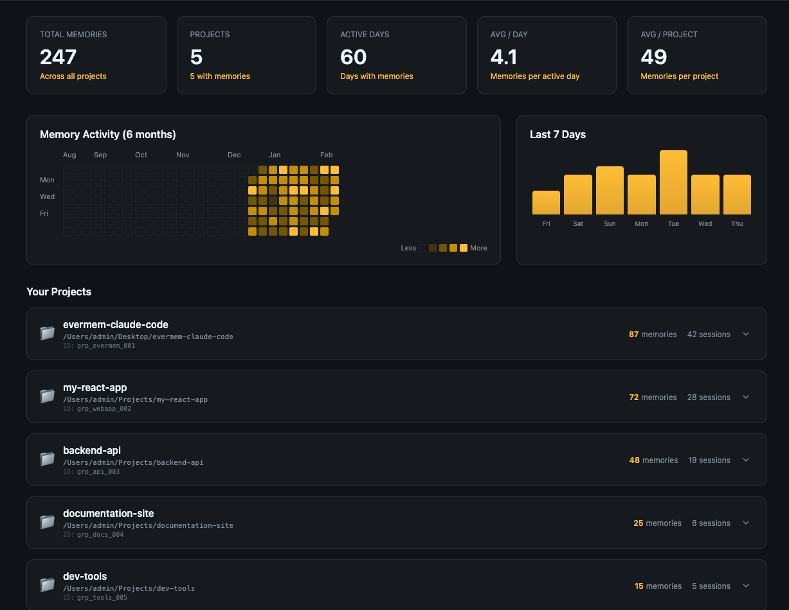

# EverMem Plugin for Claude Code

Persistent memory for Claude Code. Automatically saves and recalls context from past coding sessions.

> **🎉 新增：本地 EverMemOS 支持！** 现在你可以使用完全本地托管的 EverMemOS 服务，无需云账号。详见 [LOCAL_SETUP.md](LOCAL_SETUP.md)。



## Features

- **Automatic Memory Save** - Conversations are saved when Claude finishes responding
- **Automatic Memory Retrieval** - Relevant memories are retrieved when you submit a prompt
- **Session Context** - Recent work summary loaded on session start
- **Memory Search** - Manually search your memory history
- **Memory Hub** - Visual dashboard to explore and manage memories
- **Force Remember** - Explicitly save important information with keywords or command

## Quick Install

```bash
curl -fsSL https://raw.githubusercontent.com/EverMind-AI/evermem-claude-code/main/install.sh | bash
```

This will:
1. Prompt for your EverMem API key
2. Save it to your shell profile
3. Install the plugin via Claude Code's plugin system

**Get your API key:** [console.evermind.ai](https://console.evermind.ai/)

## Manual Installation

### 1. Get Your API Key

Visit [console.evermind.ai](https://console.evermind.ai/) to create an account and get your API key.

### 2. Configure Environment Variable

Add to your shell profile (`~/.zshrc` or `~/.bashrc`):

```bash
export EVERMEM_API_KEY="your-api-key-here"
```

Reload your shell:

```bash
source ~/.zshrc  # or source ~/.bashrc
```

### 3. Install the Plugin

```bash
# Add marketplace from GitHub (tracks updates automatically)
claude plugin marketplace add https://github.com/EverMind-AI/evermem-claude-code

# Install the plugin
claude plugin install evermem@evermem --scope user
```

To update the plugin later:

```bash
claude plugin marketplace update evermem
claude plugin update evermem@evermem
```

### 4. Verify Installation

Run `/evermem:help` to check if the plugin is configured correctly.

## Quick Start Example

Here's a typical workflow showing how EverMem enhances your Claude Code experience:

### Scenario: Building a Family Information System

**Step 1: Save Important Information with Force Remember**

```
You: 帮我记一下：我的老婆是黄蓉
Claude: 💾 Force saved 1 memory(s) to EverMemOS.

You: 帮我记一下：我儿子是王致远
Claude: 💾 Force saved 1 memory(s) to EverMemOS.

You: remember this: My hometown is Huludao
Claude: 💾 Force saved 1 memory(s) to EverMemOS.
```

**Step 2: Later, Search for Family Information**

```
You: /evermem:search 我的家庭成员有哪些？

Searching EverMem Cloud...
Query: "我的家庭成员有哪些？"
Found 3 memories:
======================================================================

1. [Score: 0.92] 2026/2/27 16:30:15
----------------------------------------------------------------------
我的老婆是黄蓉

2. [Score: 0.88] 2026/2/27 16:32:42
----------------------------------------------------------------------
我儿子是王致远

3. [Score: 0.75] 2026/2/27 16:35:08
----------------------------------------------------------------------
My hometown is Huludao

======================================================================
```

**Step 3: Open Memory Hub for Visual Overview**

```
You: /evermem:hub

Memory Hub server started. Open this URL to view your memories:
http://localhost:3456/
```

The Memory Hub dashboard shows:
- **Activity Heatmap**: Your coding/memory activity over the last 6 months
- **Statistics**: Total memories, projects, active days
- **Project Groups**: Memories organized by project
- **Timeline View**: Chronological view of all memories

**Step 4: Automatic Memory Recall in New Sessions**

When you start a new Claude Code session in the same project:

```
💡 EverMem: Last session (2h ago): "Saved family member information" | 3 memories
```

Your previous context is automatically loaded, so you can continue:

```
You: 帮我添加一个新的家庭成员信息
Claude: I see you've been building a family information system. You previously saved information about
your wife (黄蓉), son (王致远), and hometown (Huludao). What new family member would you like to add?
```

---

## Usage

### Commands

| Command | Description |
|---------|-------------|
| `/evermem:help` | Show setup status and available commands |
| `/evermem:search <query>` | Search your memories for specific topics |
| `/evermem:ask <question>` | Ask about past work (combines memory + context) |
| `/evermem:hub` | Open the Memory Hub dashboard |
| `/evermem:debug` | View debug logs for troubleshooting |
| `/evermem:projects` | View your Claude Code projects table |
| `/remember [content]` | Force save current conversation or content as memory |

### Automatic Behavior

The plugin works automatically in the background:

**On Session Start:**
```
💡 EverMem: Last session (2h ago): "Implementing JWT authentication..." | 3 memories
```
Recent memories and last session summary are loaded to provide context.

**On Prompt Submit:**
```
You: "How should I handle authentication?"
         ↓
📝 Memory Retrieved (2):
  • [0.85] (2 days ago) Discussion about JWT token implementation
  • [0.72] (1 week ago) Auth middleware setup decisions
         ↓
Claude receives the relevant context and responds accordingly
```

**On Response Complete:**
```
💾 EverMem: Memory saved (4 messages)
```

### Memory Hub

The Memory Hub provides a visual interface to explore your memories:

- Activity heatmap (GitHub-style, 6 months)
- Memory statistics (Total, Projects, Active Days, Avg/Day, Avg/Project)
- Last 7 Days growth chart
- Project-based memory grouping with expandable cards
- Timeline view within each project (grouped by date)
- Load more pagination for large projects

To use the hub, run `/evermem:hub` and follow the instructions.

### Force Remember

Sometimes you want to explicitly save important information without waiting for automatic extraction. Use **Force Remember** in two ways:

**1. Keywords in your message:**
```
You: "帮我记一下：这个API的密钥要放在环境变量里"
         ↓
💾 Force saved to EverMemOS.

You: "remember this: The database schema uses UUIDs for primary keys"
         ↓
💾 Force saved to EverMemOS.
```

Supported keywords:
- Chinese: `帮我记一下`, `帮我记住`, `记住这个`, `强制记忆`, `记一下`, `记录一下`
- English: `force remember`, `remember this`, `save this`, `note this down`, `write this down`

**2. Slash command:**
```
/remember
```
This saves the last conversation turn immediately.

**Use cases:**
- Save an important decision or conclusion
- Record a code snippet or configuration
- Mark a task as completed
- Save context before switching topics

## Configuration

### Environment Variables

| Variable | Description | Required |
|----------|-------------|----------|
| `EVERMEM_API_KEY` | Your EverMem API key | Yes |

### Project-Specific Settings

Create `.claude/evermem.local.md` in your project root for per-project configuration:

```markdown
---
group_id: "my-project"
---

Project-specific notes here.
```

## Troubleshooting

### API Key Not Configured

```bash
# Check if the key is set
echo $EVERMEM_API_KEY

# If empty, add to your shell profile and reload
export EVERMEM_API_KEY="your-key-here"
source ~/.zshrc
```

### No Memories Found

1. Memories are only recalled after you've had previous conversations
2. Short prompts (less than 3 words) are skipped
3. Check that your API key is valid at [console.evermind.ai](https://console.evermind.ai/)

### API Errors

- **403 Forbidden**: Invalid or expired API key
- **502 Bad Gateway**: Server temporarily unavailable, try again

### Debug Mode

Enable debug logging to troubleshoot issues:

```bash
# Set environment variable
export EVERMEM_DEBUG=1

# View logs in real-time
tail -f /tmp/evermem-debug.log

# Clear logs
> /tmp/evermem-debug.log
```

Run `/evermem:debug` to view recent debug logs directly.

## Links

- **Console**: [console.evermind.ai](https://console.evermind.ai/)
- **API Documentation**: [docs.evermind.ai](https://docs.evermind.ai)
- **Issues**: [GitHub Issues](https://github.com/EverMind-AI/evermem-claude-code/issues)

## License

MIT

---

# Technical Details

The following sections explain how EverMem works internally. This is useful for developers who want to understand the implementation or contribute to the project.

## How It Works

```
┌─────────────────────────────────────────────────────────────┐
│                     Session Start                            │
└─────────────────────────────────────────────────────────────┘
                            │
                            ▼
┌─────────────────────────────────────────────────────────────┐
│  SessionStart Hook                                          │
│  • Fetches recent memories from EverMem Cloud               │
│  • Loads last session summary from local storage            │
│  • Injects session context into Claude's prompt             │
└─────────────────────────────────────────────────────────────┘
                            │
                            ▼
┌─────────────────────────────────────────────────────────────┐
│                     Your Prompt                              │
└─────────────────────────────────────────────────────────────┘
                            │
                            ▼
┌─────────────────────────────────────────────────────────────┐
│  UserPromptSubmit Hook                                      │
│  • Searches EverMem Cloud for relevant memories             │
│  • Displays memory summary to user                          │
│  • Injects context into Claude's prompt                     │
└─────────────────────────────────────────────────────────────┘
                            │
                            ▼
┌─────────────────────────────────────────────────────────────┐
│                   Claude Response                            │
└─────────────────────────────────────────────────────────────┘
                            │
                            ▼
┌─────────────────────────────────────────────────────────────┐
│  Stop Hook                                                  │
│  • Extracts conversation from transcript                    │
│  • Sends to EverMem Cloud for storage                       │
│  • Server generates summary and stores memory               │
└─────────────────────────────────────────────────────────────┘
                            │
                            ▼
┌─────────────────────────────────────────────────────────────┐
│                     Session End                              │
└─────────────────────────────────────────────────────────────┘
                            │
                            ▼
┌─────────────────────────────────────────────────────────────┐
│  SessionEnd Hook                                            │
│  • Parses transcript to extract first user prompt           │
│  • Saves session summary to local storage                   │
│  • No AI calls - pure local data extraction                 │
└─────────────────────────────────────────────────────────────┘
```

## Claude Code Hooks Mechanism

> Reference: [Claude Code Hooks Documentation](https://docs.anthropic.com/en/docs/claude-code/hooks)

Claude Code provides a **hooks system** that allows plugins to execute custom scripts at specific lifecycle events. Hooks are **event-driven** - they don't run continuously but are triggered by Claude Code at specific moments.

### How Hooks Work

```
┌─────────────────────────────────────────────────────────────────┐
│                    Claude Code (Main Process)                   │
│                                                                 │
│  1. Event occurs (e.g., user sends message, Claude responds)    │
│  2. Claude Code reads hooks.json                                │
│  3. Finds matching hooks for the event                          │
│  4. Spawns child process: node <script.js>                      │
│  5. Sends JSON data via stdin pipe ─────────────┐               │
│  6. Reads response from stdout                  │               │
└─────────────────────────────────────────────────│───────────────┘
                                                  │
                                                  ▼
┌─────────────────────────────────────────────────────────────────┐
│                    Hook Script (Child Process)                  │
│                                                                 │
│  // Read JSON from stdin (sent by Claude Code)                  │
│  let input = '';                                                │
│  for await (const chunk of process.stdin) {                     │
│    input += chunk;                                              │
│  }                                                              │
│  const hookInput = JSON.parse(input);                           │
│                                                                 │
│  // Process and return result via stdout                        │
│  console.log(JSON.stringify({ ... }));                          │
└─────────────────────────────────────────────────────────────────┘
```

### Hook Events

| Event | Trigger | Use Case |
|-------|---------|----------|
| `SessionStart` | Claude Code starts | Load context, setup environment |
| `UserPromptSubmit` | User sends a message | Validate prompt, inject context |
| `PreToolUse` | Before tool execution | Approve/deny/modify tool calls |
| `PostToolUse` | After tool execution | Validate results, run linters |
| `Stop` | Claude finishes responding | Save conversation, cleanup |
| `Notification` | System notification | Custom alerts |

### Plugin hooks.json Configuration

```json
{
  "hooks": {
    "EventName": [
      {
        "matcher": "*",           // Pattern to match (for tool events)
        "hooks": [
          {
            "type": "command",
            "command": "${CLAUDE_PLUGIN_ROOT}/scripts/my-hook.js",
            "timeout": 30         // Timeout in seconds
          }
        ]
      }
    ]
  }
}
```

**Environment Variables:**
- `${CLAUDE_PLUGIN_ROOT}` - Plugin directory path (for plugins)
- `${CLAUDE_PROJECT_DIR}` - Project root directory

### EverMem Plugin Hooks

```json
{
  "hooks": {
    "SessionStart": [...],        // Load session context + track groups locally
    "UserPromptSubmit": [...],    // Search & inject memories
    "Stop": [...],                // Save conversation to cloud
    "SessionEnd": [...]           // Save session summary locally
  }
}
```

## SessionStart Hook

The SessionStart hook runs when Claude Code starts a new session. It loads recent memories from the cloud and last session summary from local storage.

### Architecture

```
┌─────────────────────────────────────────────────────────────────┐
│                    Claude Code Session Start                     │
│                                                                  │
│  1. Claude Code spawns: session-context-wrapper.sh              │
│  2. Wrapper checks npm dependencies                              │
│  3. Wrapper executes: node session-context.js                   │
└─────────────────────────────────────────────────────────────────┘
                               │
                               ▼
┌─────────────────────────────────────────────────────────────────┐
│                    session-context.js                            │
│                                                                  │
│  1. Read hook input from stdin (contains cwd)                   │
│  2. Save group to local storage (groups.jsonl)                  │
│  3. Fetch recent memories from EverMem API (limit: 100)         │
│  4. Take the 5 most recent memories                             │
│  5. Get last session summary from sessions.jsonl                │
│  6. Output systemMessage + systemPrompt via stdout              │
└─────────────────────────────────────────────────────────────────┘
                               │
                               ▼
┌─────────────────────────────────────────────────────────────────┐
│                    Claude Code Receives                          │
│                                                                  │
│  • systemMessage: "💡 EverMem: Last session (2h ago): \"...\" | 5 memories"│
│  • systemPrompt: <session-context>...</session-context>         │
│                                                                  │
│  The systemPrompt is injected into Claude's context window      │
└─────────────────────────────────────────────────────────────────┘
```

### Hook Input (stdin)

```json
{
  "session_id": "<session-uuid>",
  "cwd": "/path/to/your/project",
  "permission_mode": "default",
  "hook_event_name": "SessionStart"
}
```

### Hook Output (stdout)

```json
{
  "continue": true,
  "systemMessage": "💡 EverMem: Last session (2h ago): \"Implementing JWT authentication...\" | 5 memories",
  "systemPrompt": "<session-context>\nLast session (2h ago, 5 turns): Implementing JWT authentication for the API\n\nRecent memories (5):\n\n[1] (2/9/2026) JWT token implementation\n...\n</session-context>"
}
```

### Output Fields

| Field | Description |
|-------|-------------|
| `continue` | Always `true` - never block session start |
| `systemMessage` | Displayed to user in terminal |
| `systemPrompt` | Injected into Claude's context (invisible to user) |

### Data Sources

The hook combines two data sources:

1. **Cloud Memories** - Recent memories from EverMem API (5 most recent)
2. **Local Session Summary** - Last session from `data/sessions.jsonl` (saved by SessionEnd hook)

No AI summarization is used - pure local data extraction for zero latency and no additional API costs.

### Error Handling

| Error Type | User Message |
|------------|--------------|
| Network error | "Cannot reach EverMem server. Check your internet connection." |
| Timeout | "EverMem server is slow or unreachable." |
| 401/Unauthorized | "Authentication failed. Check your EVERMEM_API_KEY." |
| 404 | "API endpoint not found. Check EVERMEM_BASE_URL." |
| Module not found | "Missing dependency. Run: npm install" |

All errors return `continue: true` to ensure session starts normally.

### Node.js Version Check

The hook requires Node.js 18+ for ES modules support. If an older version is detected:

```json
{
  "continue": true,
  "systemMessage": "⚠️ EverMem: Node.js 16.x is too old. Please upgrade to Node.js 18+."
}
```

## SessionEnd Hook

The SessionEnd hook runs when a Claude Code session ends. It saves a session summary to local storage for use by the SessionStart hook.

### Architecture

```
┌─────────────────────────────────────────────────────────────────┐
│                    Claude Code Session End                       │
│                                                                  │
│  Triggers: /exit, closing terminal, idle timeout                 │
│  Claude Code spawns: node session-summary.js                    │
└─────────────────────────────────────────────────────────────────┘
                               │
                               ▼
┌─────────────────────────────────────────────────────────────────┐
│                    session-summary.js                            │
│                                                                  │
│  1. Read hook input from stdin (contains transcript_path)       │
│  2. Check if session already summarized (skip if yes)           │
│  3. Parse transcript JSONL file                                 │
│  4. Extract: first user prompt, turn count, timestamps          │
│  5. Save to data/sessions.jsonl                                 │
└─────────────────────────────────────────────────────────────────┘
                               │
                               ▼
┌─────────────────────────────────────────────────────────────────┐
│                    Local Storage                                 │
│                                                                  │
│  data/sessions.jsonl:                                           │
│  {"sessionId":"abc","groupId":"...","summary":"First user       │
│   prompt truncated to 200 chars","turnCount":5,...}             │
└─────────────────────────────────────────────────────────────────┘
```

### Hook Input (stdin)

```json
{
  "session_id": "<session-uuid>",
  "transcript_path": "~/.claude/projects/<hash>/<session-uuid>.jsonl",
  "cwd": "/path/to/your/project",
  "reason": "user_exit",
  "hook_event_name": "SessionEnd"
}
```

### Hook Output (stdout)

```json
{
  "systemMessage": "📝 Session saved (5 turns): Implementing JWT authentication for the..."
}
```

### Session Summary Format

Each session is saved as a single line in `data/sessions.jsonl`:

```json
{
  "sessionId": "<session-uuid>",
  "groupId": "claude-code:/path/to/project",
  "summary": "First user prompt truncated to 200 characters",
  "turnCount": 5,
  "reason": "user_exit",
  "startTime": "2026-02-09T10:00:00.000Z",
  "endTime": "2026-02-09T10:30:00.000Z",
  "timestamp": "2026-02-09T10:30:05.000Z"
}
```

### Fields

| Field | Description |
|-------|-------------|
| `sessionId` | Unique session identifier (from Claude Code) |
| `groupId` | Project identifier (based on working directory) |
| `summary` | First user prompt (truncated to 200 chars) |
| `turnCount` | Number of conversation turns |
| `reason` | Why session ended (user_exit, idle_timeout, etc.) |
| `startTime` | First message timestamp |
| `endTime` | Last message timestamp |
| `timestamp` | When summary was saved |

### Deduplication

Each session is only saved once. Before saving, the hook checks if the sessionId already exists in `sessions.jsonl`.

### No AI Summarization

The SessionEnd hook uses a simple approach: the first user prompt becomes the session summary. This provides:

- **Zero latency** - No API calls needed
- **Zero cost** - No Haiku or other model usage
- **Reliability** - Works offline, no external dependencies

The first user prompt typically describes what the user wanted to accomplish, making it a natural summary of the session's purpose.

### Design Philosophy: Deferred Display Pattern

The SessionEnd and SessionStart hooks work together using a **"save now, display later"** pattern:

```
┌─────────────────────────────────────────────────────────────────┐
│  Session A (ending)                                             │
│                                                                 │
│  SessionEnd Hook:                                               │
│  • Extracts first user prompt, turn count, duration             │
│  • Saves to sessions.jsonl                                      │
│  • Output NOT displayed (session already closed)                │
└─────────────────────────────────────────────────────────────────┘
                               │
                               │  sessions.jsonl (local storage)
                               │
                               ▼
┌─────────────────────────────────────────────────────────────────┐
│  Session B (starting)                                           │
│                                                                 │
│  SessionStart Hook:                                             │
│  • Reads last session from sessions.jsonl                       │
│  • Displays: "Last (2h ago, 5 turns): Your question..."         │
│  • Provides continuity across sessions                          │
└─────────────────────────────────────────────────────────────────┘
```

**Why this design?**

1. **SessionEnd can't display messages** - When a session ends (`/exit`, `Ctrl+D`), the terminal is closing. Any `systemMessage` output would be lost or not visible to the user.

2. **SessionStart is the right moment** - The next time the user opens Claude Code, they see what they were working on. This creates a natural "welcome back" experience.

3. **Local-first architecture** - Session summaries are stored locally in `sessions.jsonl`, not in the cloud. This ensures:
   - Instant access (no API latency)
   - Works offline
   - No additional API costs
   - Privacy (session data stays on your machine)

4. **Graceful degradation** - If SessionEnd fails to run (e.g., `Ctrl+C` force quit), the next SessionStart still works with cloud memories. No single point of failure.

**Data Flow Summary:**

| Event | Action | Storage | Display |
|-------|--------|---------|---------|
| SessionEnd | Save summary | Local (sessions.jsonl) | None |
| SessionStart | Read summary | Local + Cloud | Yes |

## Local Groups Tracking

The SessionStart hook automatically records project groups to `data/groups.jsonl` (JSONL format):

```jsonl
{"keyId":"9a823d2f8ea5","groupId":"claude-code:/path/to/project-a","name":"project-a","path":"/path/to/project-a","timestamp":"2026-02-09T06:00:00Z"}
{"keyId":"9a823d2f8ea5","groupId":"claude-code:/path/to/api-server","name":"api-server","path":"/path/to/api-server","timestamp":"2026-02-09T08:00:00Z"}
```

**Fields:**
- `keyId`: SHA-256 hash (first 12 chars) of the API key - associates groups with accounts
- `groupId`: Unique identifier based on working directory, format: `claude-code:{path}`
- `name`: Project folder name
- `path`: Full path to the project
- `timestamp`: When the group was first recorded

**Deduplication:** Each `keyId + groupId` combination is stored only once (no duplicates).

View tracked projects with `/evermem:projects` command.

## Stop Hook: Conversation Flow

Claude Code stores all conversations locally in JSONL (JSON Lines) format. The EverMem plugin reads this transcript and uploads the latest Q&A pair to the cloud.

### Hook Input

When Claude finishes responding, the Stop hook receives input like this:

```json
{
  "session_id": "<session-uuid>",
  "transcript_path": "~/.claude/projects/<project-hash>/<session-uuid>.jsonl",
  "cwd": "/path/to/your/project",
  "permission_mode": "default",
  "hook_event_name": "Stop",
  "stop_hook_active": false
}
```

### Transcript File Format

The transcript file (`*.jsonl`) contains one JSON object per line, recording every message and event in the session. **Important:** A single Claude response may span multiple lines with different content types.

**Common Fields:**

| Field | Description |
|-------|-------------|
| `type` | Line type: `user`, `assistant`, `progress`, `system`, `file-history-snapshot` |
| `uuid` | Unique message ID |
| `parentUuid` | Parent message ID (for threading) |
| `timestamp` | ISO 8601 timestamp |
| `sessionId` | Session UUID |
| `message.role` | `user` or `assistant` |
| `message.content` | String or array of content blocks |

**Content Block Types (in `message.content` array):**

| Type | Description |
|------|-------------|
| `text` | Final text response to user |
| `thinking` | Claude's internal reasoning (extended thinking) |
| `tool_use` | Tool invocation (Read, Write, Bash, etc.) |
| `tool_result` | Result returned from tool execution |

**Complete Conversation Example:**

A single Q&A turn generates multiple JSONL lines:

```jsonl
// 1. User message
{"type":"user","message":{"role":"user","content":"debug.js 如何使用"},"uuid":"696034a3-...","timestamp":"2026-02-09T02:20:16.540Z"}

// 2. Assistant thinking (extended thinking mode)
{"type":"assistant","message":{"role":"assistant","content":[{"type":"thinking","thinking":"用户希望了解 debug.js 的使用方法...","signature":"EuAC..."}]},"uuid":"b375ff09-...","timestamp":"2026-02-09T02:20:26.866Z"}

// 3. Assistant tool use (e.g., Read file)
{"type":"assistant","message":{"role":"assistant","content":[{"type":"tool_use","id":"toolu_01Qur8BnkKD9t53JSSorDLbm","name":"Read","input":{"file_path":"/path/to/README.md"}}]},"uuid":"f01ec15c-..."}

// 4. Progress event (hook execution)
{"type":"progress","data":{"type":"hook_progress","hookEvent":"PostToolUse","hookName":"PostToolUse:Read"},"uuid":"f4219b83-..."}

// 5. Tool result (returned as user message)
{"type":"user","message":{"role":"user","content":[{"tool_use_id":"toolu_01Qur8BnkKD9t53JSSorDLbm","type":"tool_result","content":"file contents here..."}]},"uuid":"f5c5f7c6-..."}

// 6. Assistant final text response
{"type":"assistant","message":{"role":"assistant","content":[{"type":"text","text":"完成！README 已更新..."}]},"uuid":"cae1b79c-..."}

// 7. System events (stop hook, timing)
{"type":"system","subtype":"stop_hook_summary","hookCount":1,"hasOutput":true,"uuid":"25a25edf-..."}
{"type":"system","subtype":"turn_duration","durationMs":81371,"uuid":"55418b2c-..."}
```

**Simplified View:**

```
User Input
    ↓
[thinking] → [tool_use] → [tool_result] → [tool_use] → ... → [text]
    ↓
System Events (hooks, timing)
```

### Turn Boundary & Segmentation

**Session Level:** One JSONL file = One Session (filename is session ID)

**Turn Level:** A "Turn" = User sends message → Claude fully responds

**Turn boundary marker (ONLY this one):**
```json
{"type":"system","subtype":"turn_duration","durationMs":30692}
```

> **Note:** `file-history-snapshot` is NOT a turn boundary. It's a session-level marker that can appear anywhere in the file.

**JSONL Structure:**
```
Line 1:      file-history-snapshot  ← Session marker (NOT turn boundary)
Line 2-21:   Turn 1
Line 22:     turn_duration          ← Turn 1 end ✓
Line 23:     file-history-snapshot  ← Can appear mid-session (NOT turn boundary)
Line 24-43:  Turn 2
Line 44:     turn_duration          ← Turn 2 end ✓
...
```

**Message Chain (parentUuid):**
```
user (uuid: aaa, parent: None)     ← Turn start
  ↓
assistant/thinking (parent: aaa)
  ↓
assistant/tool_use (parent: ...)
  ↓
user/tool_result (parent: ...)     ← NOT user input, skip!
  ↓
assistant/text (parent: ...)       ← Final response
  ↓
system/turn_duration (parent: ...) ← Turn end
```

### Memory Extraction

The `store-memories.js` hook extracts the **last complete Turn**:

1. **Wait for completion** - Retry reading file until `turn_duration` marker appears (indicates turn is complete)
2. **Find turn boundaries** - Start after last `turn_duration`, end at current `turn_duration`
   - **ONLY** `turn_duration` is used as boundary (NOT `file-history-snapshot`)
3. **Collect user text** - Original input only (skip `tool_result`)
4. **Collect assistant text** - All `text` blocks (skip `thinking`, `tool_use`)
5. **Merge content** - Join scattered text blocks with `\n\n` separator
6. **Upload to cloud** - Send both user and assistant content to EverMem API

**Race Condition Handling:**

The Stop hook runs before `turn_duration` is written. To ensure complete content extraction:

```javascript
// Retry until turn_duration appears (max 5 attempts, 100ms delay)
async function readTranscriptWithRetry(path) {
  for (let attempt = 1; attempt <= 5; attempt++) {
    const lines = readFile(path);
    const lastLine = JSON.parse(lines[lines.length - 1]);

    // turn_duration = turn complete
    if (lastLine.type === 'system' && lastLine.subtype === 'turn_duration') {
      return lines;
    }

    await sleep(100);  // Wait and retry
  }
}
```

**Why merge?** A single Claude response spans multiple JSONL lines:
- `thinking` → `tool_use` → `tool_result` → ... → `text` (final response)

The hook merges all `text` blocks to capture the complete response.

### API Upload

Each message is sent to `POST /api/v0/memories`:

```json
{
  "message_id": "u_1770367656189",
  "create_time": "2026-02-06T08:47:36.189Z",
  "sender": "claude-code-user",
  "role": "user",
  "content": "How do I add authentication?",
  "group_id": "claude-code:/path/to/project",
  "group_name": "Claude Code Session"
}
```

Response on success:
```json
{
  "message": "Message accepted and queued for processing",
  "request_id": "<request-uuid>",
  "status": "queued"
}
```

### Hook Output (stdout)

The hook returns JSON via stdout to communicate with Claude Code:

```json
{
  "systemMessage": "💾 Memory saved (2) [user: 59, assistant: 127]"
}
```

This message is displayed to the user after Claude finishes responding.

## Memory Hub Implementation

The `/evermem:hub` command opens a web dashboard for visualizing memories. Due to browser limitations (GET requests can't have body), a local proxy server bridges the dashboard and EverMem API.

### Architecture

```
┌─────────────────────────────────────────────────────────────────────────────┐
│                           /evermem:hub Command                               │
│  1. Start proxy server: node server/proxy.js &                              │
│  2. Generate URL: http://localhost:3456/?key=${EVERMEM_API_KEY}             │
│  3. User opens URL in browser                                                │
└─────────────────────────────────────────────────────────────────────────────┘
                                    │
                                    ▼
┌─────────────────────────────────────────────────────────────────────────────┐
│                         Browser (dashboard.html)                             │
│                                                                              │
│  ┌─────────────┐  ┌─────────────┐  ┌─────────────┐  ┌─────────────┐        │
│  │   Stats     │  │  Heatmap    │  │  7-Day      │  │  Project    │        │
│  │   Cards     │  │  (6 months) │  │  Chart      │  │   Cards     │        │
│  └─────────────┘  └─────────────┘  └─────────────┘  └─────────────┘        │
│                                                                              │
│  Data Flow:                                                                  │
│  1. GET /api/groups → Local groups.jsonl (filtered by keyId)                │
│  2. For each group: POST /api/v0/memories → Fetch memories                  │
│  3. Render dashboard with aggregated data                                    │
└─────────────────────────────────────────────────────────────────────────────┘
                                    │
                                    ▼
┌─────────────────────────────────────────────────────────────────────────────┐
│                      Proxy Server (localhost:3456)                           │
│                                                                              │
│  Routes:                                                                     │
│  ┌─────────────────────────────────────────────────────────────────────┐   │
│  │  GET  /              → Serve dashboard.html                          │   │
│  │  GET  /api/groups    → Read groups.jsonl, filter by keyId           │   │
│  │  POST /api/v0/memories → Convert to GET+body, forward to API        │   │
│  │  GET  /health        → Health check                                  │   │
│  └─────────────────────────────────────────────────────────────────────┘   │
│                                                                              │
│  Why Proxy?                                                                  │
│  - Browser limitation: GET requests can't have body                         │
│  - EverMem API uses GET /api/v0/memories with JSON body                     │
│  - Proxy receives POST, converts to GET+body using curl                     │
└─────────────────────────────────────────────────────────────────────────────┘
                                    │
                                    ▼
┌─────────────────────────────────────────────────────────────────────────────┐
│                         EverMem Cloud API                                    │
│                      https://api.evermind.ai                                 │
│                                                                              │
│  GET /api/v0/memories (with body)                                           │
│  Request:  { user_id, group_id, memory_type, limit, offset }                │
│  Response: { result: { memories[], total_count, has_more } }                │
└─────────────────────────────────────────────────────────────────────────────┘
```

### Proxy Server (`server/proxy.js`)

```javascript
// Key function: Convert API key to keyId (for groups filtering)
function computeKeyId(apiKey) {
  const hash = createHash('sha256').update(apiKey).digest('hex');
  return hash.substring(0, 12);  // First 12 chars of SHA-256
}

// Key function: Read groups.jsonl and filter by keyId
function getGroupsForKey(keyId) {
  const content = readFileSync(GROUPS_FILE, 'utf8');
  const lines = content.trim().split('\n');

  const groupMap = new Map();
  for (const line of lines) {
    const entry = JSON.parse(line);
    if (entry.keyId !== keyId) continue;  // Filter by current API key

    // Aggregate: count sessions, track first/last seen
    // ...
  }
  return Array.from(groupMap.values());
}

// Key route: Forward POST as GET+body (browser workaround)
// Browser sends:  POST /api/v0/memories { body }
// Proxy sends:    GET  /api/v0/memories { body } via curl
```

### Dashboard (`assets/dashboard.html`)

**Data Loading Flow:**

```javascript
async function loadGroups() {
  // 1. Fetch groups from local storage (via proxy)
  const groupsData = await fetch('/api/groups', {
    headers: { 'Authorization': `Bearer ${apiKey}` }
  });

  // 2. For each group, fetch memories with pagination
  for (const group of groups) {
    const data = await fetch('/api/v0/memories', {
      method: 'POST',
      body: JSON.stringify({
        user_id: 'claude-code-user',
        group_id: group.id,
        memory_type: 'episodic_memory',
        limit: 100,
        offset: 0
      })
    });

    // Store: memories[], totalCount, hasMore, offset
    groupMemories[group.id] = { ... };
  }

  // 3. Render dashboard
  renderDashboard(totalMemories);
}
```

**UI Components:**

| Component | Description |
|-----------|-------------|
| Stats Grid | 5 cards: Total Memories, Projects, Active Days, Avg/Day, Avg/Project |
| Heatmap | GitHub-style 6-month activity grid with tooltips |
| Growth Chart | Last 7 days bar chart |
| Project Cards | Expandable cards showing memories per project |
| Timeline | Within each project, memories grouped by date |
| Load More | Pagination button when `has_more: true` |

**Timeline within Project:**

```
📁 evermem-claude-code (25 memories)
├── ● Sun, Feb 9 [Today]               3 memories
│   ├── 💭 Discussion about JWT...     10:30 AM
│   ├── 🔧 Fixed authentication...     09:15 AM
│   └── ✨ Created new API endpoint    08:00 AM
│
├── ● Sat, Feb 8                       5 memories
│   ├── 📝 Updated README...           16:20 PM
│   └── ...
│
└── [Load more (17 remaining)]
```

## Debug Logging

Both `inject-memories.js` and `store-memories.js` use a shared debug utility:

```javascript
import { debug, setDebugPrefix } from './utils/debug.js';

setDebugPrefix('inject');  // Log lines will show [inject] prefix
debug('hookInput:', data); // Only writes when EVERMEM_DEBUG=1
```

**Debug output by script:**

| Script | Prefix | Debug Points |
|--------|--------|--------------|
| `inject-memories.js` | `[inject]` | hookInput, search query, search results, filtered/selected memories, output |
| `store-memories.js` | `[store]` | hookInput, read attempts, turn range, line types, extracted content, results |

**Example debug log:**

```log
# Memory injection (UserPromptSubmit hook)
[2026-02-06T08:47:30.100Z] [inject] hookInput: { "prompt": "How do I add auth?", ... }
[2026-02-06T08:47:30.150Z] [inject] searching memories for prompt: How do I add auth?
[2026-02-06T08:47:30.500Z] [inject] search results: {"total": 5, "memories": [...]}
[2026-02-06T08:47:30.520Z] [inject] selected memories: [{"score": 0.85, "subject": "JWT implementation"}]

# Memory storage (Stop hook)
[2026-02-06T08:47:36.184Z] [store] hookInput: { "transcript_path": "...jsonl", ... }

# Retry logic - waiting for turn_duration
[2026-02-06T08:47:36.200Z] [store] read attempt 1: { "totalLines": 525, "isComplete": false, "lastLineType": "progress" }
[2026-02-06T08:47:36.201Z] [store] turn not complete, waiting 100ms before retry...
[2026-02-06T08:47:36.310Z] [store] read attempt 2: { "totalLines": 527, "isComplete": false, "lastLineType": "system/stop_hook_summary" }
[2026-02-06T08:47:36.311Z] [store] turn not complete, waiting 100ms before retry...
[2026-02-06T08:47:36.420Z] [store] read attempt 3: { "totalLines": 528, "isComplete": true, "lastLineType": "system/turn_duration" }

# Content extraction
[2026-02-06T08:47:36.425Z] [store] turn range: { "turnStartIndex": 500, "turnEndIndex": 528, "totalLines": 528 }
[2026-02-06T08:47:36.430Z] [store] assistantTexts count: 3
[2026-02-06T08:47:36.435Z] [store] extracted: { "userLength": 59, "assistantLength": 847, ... }

# API upload results
[2026-02-06T08:47:36.970Z] [store] results: [
  {
    "type": "USER",
    "len": 59,
    "status": 202,
    "ok": true,
    "response": {
      "message": "Message accepted and queued for processing",
      "status": "queued"
    }
  },
  {
    "type": "ASSISTANT",
    "len": 127,
    "status": 202,
    "ok": true,
    "response": { ... }
  }
]
[2026-02-06T08:47:36.975Z] [store] skipped: []
```

**Using debug.js in your own hooks:**

```javascript
import { debug, setDebugPrefix, isDebugEnabled } from './utils/debug.js';

// Set prefix to identify your script in logs
setDebugPrefix('my-hook');

// Log objects (auto JSON stringified) or strings
debug('processing:', { key: 'value' });

// Check if debug is enabled
if (isDebugEnabled()) {
  // expensive debug operations
}
```

## Project Structure

```
evermem-plugin/
├── plugin.json               # Plugin manifest
├── commands/
│   ├── help.md               # /evermem:help command
│   ├── search.md             # /evermem:search command
│   ├── hub.md                # /evermem:hub command
│   ├── debug.md              # /evermem:debug command
│   └── projects.md           # /evermem:projects command
├── data/
│   ├── groups.jsonl          # Local storage for tracked projects (JSONL format)
│   └── sessions.jsonl        # Local storage for session summaries (JSONL format)
├── hooks/
│   ├── hooks.json            # Hook configuration
│   └── scripts/
│       ├── inject-memories.js    # Memory recall (UserPromptSubmit)
│       ├── store-memories.js     # Memory save (Stop)
│       ├── session-context.js    # Session context (SessionStart)
│       ├── session-summary.js    # Session summary (SessionEnd)
│       └── utils/
│           ├── evermem-api.js    # EverMem Cloud API client
│           ├── config.js         # Configuration utilities
│           ├── debug.js          # Shared debug logging utility
│           └── groups-store.js   # Local groups persistence
├── assets/
│   └── dashboard.html        # Memory Hub dashboard
├── server/
│   └── proxy.js              # Local proxy server for dashboard
└── README.md
```

## API Reference

The plugin uses the EverMem Cloud API at `https://api.evermind.ai`:

- `POST /api/v0/memories` - Store a new memory
- `GET /api/v0/memories/search` - Search memories (hybrid retrieval, with JSON body)
- `GET /api/v0/memories` - Get memories (with query params)

## Development

### Local Development

```bash
# Clone the repository
git clone https://github.com/EverMind-AI/evermem-claude-code.git
cd evermem-claude-code

# Install dependencies
npm install

# Run Claude Code with local plugin
claude --plugin-dir .
```

### Testing Hooks

```bash
# Test memory recall
echo '{"prompt":"How do I handle authentication?"}' | node hooks/scripts/inject-memories.js

# Test memory save (requires transcript file)
echo '{"transcript_path":"/path/to/transcript.json"}' | node hooks/scripts/store-memories.js
```
